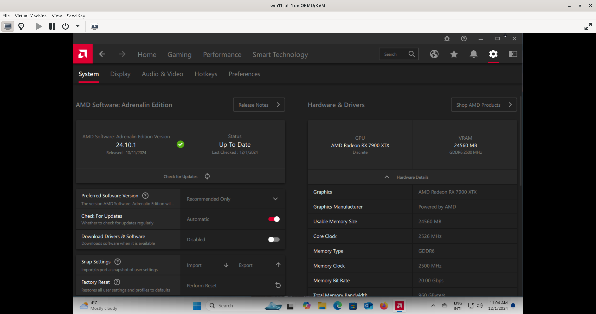
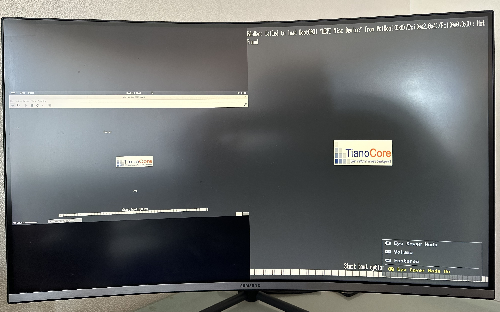
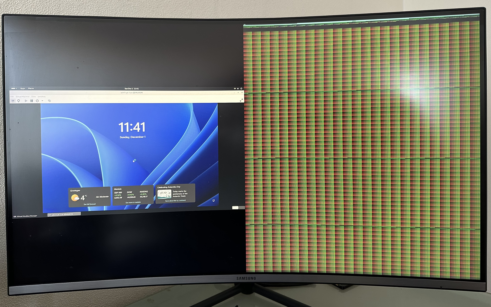

# Passing-through PCI devices (GPU, NVMe SSD, NIC, etc) to Virtual Machine (VM)

PCI passthrough enables a virtual machine (VM) of any OS to have its dedicated hardware (eg a GPU) with near-native performance. See [PCI_passthrough_via_OVMF](https://wiki.archlinux.org/title/PCI_passthrough_via_OVMF) for more. 


We already have Windows 11 installed (bare-metal) on an M.2 NVMe SSD. **We now want to passthrough the NVMe drive and a dedicated graphics card to a VM**,
so we can flexibly run the same Windows both as a VM as well as a host directly on the hardware.

So far I've got:

- [AMD Adrenalin](https://www.amd.com/en/products/software/adrenalin.html) to detect GPU on Windows 11 VM
- PyTorch to detect GPU (CUDA/ROCm) on RHEL 9.4 VM

|                                                    |                                                  |
|----------------------------------------------------|--------------------------------------------------|
|  |      |

**But the GPU display output is still having rendering issue**

|                                                     |                                                               |
|-----------------------------------------------------|---------------------------------------------------------------|
|  |  |

The left half (of a monitor with dual display inputs) shows the host (via motherboard HDMI) running Windows VM in the virt-manager GUI.
The right shows the passthrough GPU's output to the VM, which appears to have rendering issues after UEFI boot message,
likely related to framebuffer settings.

## Host (Linux)

I'm running Fedora 41 Workstation on AsRock X870E Taichi Lite motherboard with AMD Ryzen 7950X CPU.
And we want to passthrough an AMD Radeon RX 7900 XTX GPU to VMs.

1. Enable Virtualization and IOMMU on BIOS/UEFI. Next ensure Virtualization and IOMMU from host shell.

```sh
sudo dmesg | grep -i -e DMAR -e IOMMU
```

Also check IOMMU devices by group

```sh
shopt -s nullglob
for g in $(find /sys/kernel/iommu_groups/* -maxdepth 0 -type d | sort -V); do
    echo "IOMMU Group ${g##*/}:"
    for d in $g/devices/*; do
        echo -e "\t$(lspci -nns ${d##*/})"
    done;
done;
```

For passthrough, all devices within an IOMMU group must be bound to a VFIO device driver eg `vfio-pci` for PCI devices.

2. Find the [BDF](https://wiki.xenproject.org/wiki/Bus:Device.Function_(BDF)_Notation) id, `vendor_id:device_id` of the GPU, NVMe drive etc to be passed-through

```sh
lspci -nnv | grep -A10 -E 'VGA|Audio|NVMe'
```

Output looks somewhat like

```sh
03:00.0 VGA compatible controller [0300]: Advanced Micro Devices, Inc. [AMD/ATI] Navi 31 [Radeon RX 7900 XT/7900 XTX/7900 GRE/7900M] [1002:744c] (rev c8) (prog-if 00 [VGA controller])
        Subsystem: Sapphire Technology Limited NITRO+ RX 7900 XTX Vapor-X [1da2:e471]
        Flags: bus master, fast devsel, latency 0, IRQ 186, IOMMU group 15
        Kernel driver in use: amdgpu
        Kernel modules: amdgpu

03:00.1 Audio device [0403]: Advanced Micro Devices, Inc. [AMD/ATI] Navi 31 HDMI/DP Audio [1002:ab30]
        Subsystem: Advanced Micro Devices, Inc. [AMD/ATI] Navi 31 HDMI/DP Audio [1002:ab30]
        Flags: bus master, fast devsel, latency 0, IRQ 176, IOMMU group 16
        Kernel driver in use: snd_hda_intel
        Kernel modules: snd_hda_intel

6e:00.0 Non-Volatile memory controller [0108]: Micron/Crucial Technology P3 Plus NVMe PCIe SSD (DRAM-less) [c0a9:5421] (rev 01) (prog-if 02 [NVM Express])
        Subsystem: Micron/Crucial Technology Device [c0a9:5021]
        Flags: bus master, fast devsel, latency 0, IRQ 24, IOMMU group 19
        Kernel driver in use: nvme
        Kernel modules: nvme
```

GPUs typically have a VGA and an Audio *Function* / component; both need to be bound to `vfio-pci` kernel driver.

>**On host we must ensure for the devices designated for passthrough**
```sh
        Kernel driver in use: vfio-pci
```
as opposed to `amdgpu`, `nvidia`, `snd_hda_intel`, `nvme` etc.
We achive this by binding `03:00.0`, `03:00.1`, and `6e:00.0` PCI devices to vfio-pci driver with
`vfio-pci.ids=1002:744c,1002:ab30,c0a9:5421` kernel params. Your device ids will be different; adjust accordingly.

3. Update kernel params through `GRUB_CMDLINE_LINUX` in `/etc/default/grub`

```sh
# For AMD CPUs
GRUB_CMDLINE_LINUX="APPEND TO EXISTING PARAMS amd_iommu=on iommu=pt video=efifb:off vfio-pci.ids=1002:744c,1002:ab30,c0a9:5421"

# For Intel CPUs
GRUB_CMDLINE_LINUX="APPEND TO EXISTING PARAMS intel_iommu=on iommu=pt video=efifb:off vfio-pci.ids=1002:744c,1002:ab30,c0a9:5421"
```

| Parameter                         | Description                               | Usage                              |
|-----------------------------------|-------------------------------------------|------------------------------------|
| `amd_iommu=on` / `intel_iommu=on` | Enables IOMMU for device passthrough      | **Required**                       |
| `iommu=pt`                        | Enables pass-through mode                 | Recommended for performance        |
| `vfio-pci.ids=vendor:device`      | Binds devices to VFIO driver  | Alternatives: modprobe or [manual bindinng](./vfio.sh) |
| `video=efifb:off`                 | Disables EFI framebuffer      | Useful when dedicated display available for VM |

3. Configure VFIO by binding devices to vfio-pci driver for passthrough and interrupt handling

```sh
cat <<EOF | sudo tee /etc/modprobe.d/vfio.conf 
options vfio-pci ids=1002:744c,1002:ab30,c0a9:5421    ## optional if supplied vfio-pci.ids in GRUB_CMDLINE_LINUX
options vfio_iommu_type1 allow_unsafe_interrupts=1
softdep drm pre: vfio-pci
EOF
```

If the driver isn't shared with host at all, optionally blacklist default/conflicting drivers.
The integrated GPU in Ryzen 7000 series CPU also uses `amdgpu` driver, so I don't.
Blacklisting drivers still works through *software rendering* but suffers a bit of performance overhead. 

```sh
cat <<EOF | sudo tee /etc/modprobe.d/vfio-blacklist.conf 
blacklist amdgpu             ### nvidia
blacklist snd_hda_intel
EOF
```

4. Regenerate initramfs with VFIO drivers

- On rpm-based OS eg Fedora, RHEL, first configure `dracut` to include VFIO drivers in initramfs.

```sh
cat <<EOF | sudo tee /etc/dracut.conf.d/00-vfio.conf 
force_drivers+=" vfio_pci vfio vfio_iommu_type1 "
EOF

sudo dracut -f --kver $(uname -r)
## or
# sudo dracut -f --regenerate-all
```

- Debian-derived distros eg Ubuntu: gotta checkout; if you know, feel free to share your knowledge by creating a PR.

5. Generate the GRUB2 configuration file
```sh
sudo grub2-mkconfig -o /boot/grub2/grub.cfg
```

6. Reboot the host
```sh
sudo reboot now
```

7. After reboot, verify `Kernel driver in use: vfio-pci` for the devices

```sh
lspci -nk | grep -A3 -E '03.00.0|03.00.1|6e.00.0'
```
Expected output

```sh
03:00.0 0300: 1002:744c (rev c8)
	Subsystem: 1da2:e471
	Kernel driver in use: vfio-pci
	Kernel modules: amdgpu
03:00.1 0403: 1002:ab30
	Subsystem: 1002:ab30
	Kernel driver in use: vfio-pci
	Kernel modules: snd_hda_intel
--
6e:00.0 0108: c0a9:5421 (rev 01)
	Subsystem: c0a9:5021
	Kernel driver in use: vfio-pci
	Kernel modules: nvme
```

8. Install virtualization tools (libvirt, qemu, etc)

```sh
sudo dnf group install -y --with-optional virtualization
sudo dnf install -y qemu-kvm-core libvirt guestfs-tools libguestfs-tools # extras for building, editing images
sudo dnf install -y edk2-ovmf swtpm swtpm-tools # for tpm, secureboot
sudo systemctl enable --now libvirtd
sudo virsh net-autostart default
sudo usermod -aG libvirt $LOGNAME

### optionally create a bridge network, so the VM has an IP from the LAN
### in examples here, we provide `--network bridge=br-enp113s0` flag in `virt-install` command
ETH_NIC=enp113s0 # retrieve from `nmcli device` output
sudo nmcli connection add type bridge ifname br-$ETH_NIC con-name br-$ETH_NIC
sudo nmcli connection add type ethernet ifname $ETH_NIC master br-$ETH_NIC
sudo nmcli connection up br-$ETH_NIC
sudo nmcli connection modify br-$ETH_NIC connection.autoconnect yes # set bridge to autoconnect
# this bridge setup with nmcli might require reboot to work properly
```

## Guest (any OS)

- ### Windows 11

```sh
sudo virt-install --name win11-pt-1 \
  --cpu host-passthrough,cache.mode=passthrough \
  --vcpus 16,maxvcpus=16,sockets=1,cores=8,threads=2 \
  --memory 32768 \
  --os-variant win11 \
  --graphics spice,gl=yes,listen=none \
  --video virtio \
  --sound ich9 \
  --console pty,target.type=virtio \
  --noautoconsole \
  --serial pty \
  --network bridge=br-enp113s0 \
  --network bridge=virbr0 \
  --disk path=/var/lib/libvirt/boot/virtio-win.iso,device=cdrom \
  --boot uefi \
  --boot menu=on \
  --boot loader=/usr/share/edk2/ovmf/OVMF_CODE.secboot.fd,loader.readonly=yes,loader.type=pflash,nvram.template=/usr/share/edk2/ovmf/OVMF_VARS.secboot.fd,loader_secure=yes \
  --tpm emulator,model=tpm-crb,version=2.0 \
  --hostdev pci_0000_03_00_0 \
  --hostdev pci_0000_03_00_1 \
  --hostdev pci_0000_6e_00_0 \
  --import
```

The `--disk path=/var/lib/libvirt/boot/virtio-win.iso,device=cdrom` attaches Windows drivers for VirtIO devices as a CDROM.
[`virtio-win`](https://fedorapeople.org/groups/virt/virtio-win/direct-downloads/latest-virtio/virtio-win.iso) drivers are
apparently required for networking etc to work seamlessly.
See [virtio-win/kvm-guest-drivers-windows](https://github.com/virtio-win/kvm-guest-drivers-windows/wiki/Driver-installation) for more.

Install 'em once, and then detach the CDROM so that during boots the UEFI doesn't try to boot from it.

When installing Windows afresh either on a clean NVMe or VirtIO drive, remove `--import` and supply below args
- `--cdrom /var/lib/libvirt/boot/Win11_24H2_EnglishInternational_x64.iso` Installation disk
- `--disk /var/lib/libvirt/images/win11-pt-1.qcow2,size=500,bus=virtio`   Attach a 500 GiB (Gibibytes) VirtIO SCSI storage device. Requires `virtio-win` drivers
- `--boot hd,cdrom,menu=on`                                               Specify boot order

- ### RHEL 9.4
See [extras.md](./extras.md) 
