# Useful cmds etc

<p align="center">
  
</p>

## Manually bind devices to driver

Given a PCI device `BB:DD.F` eg `6e:00.0` from  `lspci` output and associated/default kernel driver,
we can `bind` it to vfio-pci driver

```sh
echo 0000:6e:00.0 | sudo tee /sys/bus/pci/drivers/nvme/unbind
echo vfio-pci | sudo tee /sys/bus/pci/devices/0000:6e:00.0/driver_override
echo 0000:6e:00.0 | sudo tee /sys/bus/pci/drivers/vfio-pci/bind
```

And revert to default driver

```sh
echo 0000:6e:00.0 | sudo tee /sys/bus/pci/drivers/vfio-pci/unbind
echo | sudo tee /sys/bus/pci/devices/0000:6e:00.0/driver_override
echo 0000:6e:00.0 | sudo tee /sys/bus/pci/drivers/nvme/bind
```

# vfio bind 6e:00.0 nvme
# vfio unbind 6e:00.0 nvme

## VFIO IDs

Bus | Device | Function| vendor_id:device_id| vfio-pci.ids        | hostdev (derived) |
----|--------|---------|--------------------|---------------------|-------------------|
03  |   00   |    0    |    1002:744c       | 1002:744c,1002:ab30 | pci_0000_03_00_0  |
03  |   00   |    1    |    1002:ab30       |                     | pci_0000_03_00_1  |

We use the identifiers
- **vfio-pci.ids** to prevent default kernel driver from taking control of the target GPU so vfio-pci has exclusive control of it
- **hostdev** to attach the GPU to any VM; a GPU can't be attached to more than one **running** VM

## Install Guest VM

### Linux
Tested passthrough on RHEL9.4 with AMD ROCm 6.2. I couldn't yet get ROCm to work (reliably, consistently) on Ubuntu24.04.

> **`virt-install`** command occasionally errors
```sh
ERROR    internal error: Could not run '/usr/bin/swtpm_setup'. exitstatus: 1; Check error log '/var/log/swtpm/libvirt/qemu/ubuntu2404-rocm6-2-swtpm.log' for details.
Domain installation does not appear to have been successful.
```

Just rerun the commnad. That's the fix for now.

1. Download installation image
- RHEL: Download from [https://access.redhat.com/downloads](https://access.redhat.com/downloads)

- Ubuntu
```sh
sudo curl -L https://releases.ubuntu.com/noble/ubuntu-24.04.1-live-server-amd64.iso -o /var/lib/libvirt/boot/ubuntu-24.04.1.iso
```

2. Install VM

- RHEL
```sh
sudo virt-install --name rhel94-rocm6 \
  --cpu host-passthrough,cache.mode=passthrough \
  --vcpus 16,maxvcpus=16,sockets=1,cores=8,threads=2 \
  --memory 32768 \
  --os-variant rhel9.4 \
  --graphics vnc  \
  --console pty,target_type=serial \
  --noautoconsole \
  --serial pty \
  --cdrom /var/lib/libvirt/boot/rhel-9.4-x86_64-dvd.iso \
  --disk /var/lib/libvirt/images/rhel94-rocm6.qcow2,size=500,bus=virtio \
  --network bridge=br-enp113s0 \
  --boot uefi \
  --boot hd,cdrom,menu=on \
  --boot loader=/usr/share/edk2/ovmf/OVMF_CODE.fd,loader.readonly=yes,loader.type=pflash,nvram.template=/usr/share/edk2/ovmf/OVMF_VARS.fd \
  --hostdev pci_0000_03_00_0 --hostdev pci_0000_03_00_1
```

- Ubuntu
```sh
sudo virt-install --name ubuntu24-rocm6 \
  --cpu host-passthrough,cache.mode=passthrough \
  --vcpus 16,maxvcpus=16,sockets=1,cores=8,threads=2 \
  --memory 32768 \
  --os-variant ubuntu24.04 \
  --graphics vnc  \
  --console pty,target_type=serial \
  --noautoconsole \
  --serial pty \
  --cdrom /var/lib/libvirt/boot/ubuntu-24.04.1.iso \
  --disk /var/lib/libvirt/images/ubuntu24-rocm6.qcow2,size=500,bus=virtio \
  --network bridge=br-enp113s0 \
  --boot uefi \
  --boot hd,cdrom,menu=on \
  --boot loader=/usr/share/edk2/ovmf/OVMF_CODE.fd,loader.readonly=yes,loader.type=pflash,nvram.template=/usr/share/edk2/ovmf/OVMF_VARS.fd \
  --hostdev pci_0000_03_00_0 --hostdev pci_0000_03_00_1
```

Follow through a few steps in virt-manager GUI. Enable SSH server if you want to access VM shell from host or elsewhere.

3. Access the VM eg via SSH from host

```sh
# One way to find new VM's IP when bridge network is used with DHCP
nmap -sn 192.168.0.0/24 # replace with your (home LAN) subnet
# it prints discovered IPs, hopefully including that of newly created VM
# check if port 22 open of suspected IP
nc -zv 192.168.0.221 22 # replace
## optionally copy ssh key
# ssh-copy-id username_entered_during_installation@VM_IP
# SSH into the VM
ssh username_entered_during_installation@VM_IP
```

You might want to see [ide.md](./ide.md) if you use text-based editor like vim over SSH.

4. Install AMD ROCm

- Ubuntu
```sh
sudo apt update
sudo apt install -y "linux-headers-$(uname -r)" "linux-modules-extra-$(uname -r)"
sudo usermod -a -G render,video $LOGNAME # Add the current user to the render and video groups
wget https://repo.radeon.com/amdgpu-install/6.2.4/ubuntu/noble/amdgpu-install_6.2.60204-1_all.deb
sudo apt install -y ./amdgpu-install_6.2.60204-1_all.deb
sudo apt update
sudo apt install -y amdgpu-dkms rocm
sudo reboot now
```

- RHEL9
```sh
wget https://dl.fedoraproject.org/pub/epel/epel-release-latest-9.noarch.rpm
sudo rpm -ivh epel-release-latest-9.noarch.rpm
sudo dnf install -y dnf-plugin-config-manager
sudo crb enable
sudo dnf install -y "kernel-headers-$(uname -r)" "kernel-devel-$(uname -r)"
sudo usermod -a -G render,video $LOGNAME # Add the current user to the render and video groups
sudo dnf install -y https://repo.radeon.com/amdgpu-install/6.2.4/rhel/9.4/amdgpu-install-6.2.60204-1.el9.noarch.rpm
sudo dnf clean all
sudo dnf install -y amdgpu-dkms rocm
sudo reboot now
```

5. Configure the system linker by indicating where to find the shared objects (.so files) for the ROCm applications
```sh
sudo tee --append /etc/ld.so.conf.d/rocm.conf <<EOF
/opt/rocm/lib
/opt/rocm/lib64
EOF
sudo ldconfig
````

6. Optionally verify pytorch can detect CUDA
```sh
# install python dev tools
## rhel
sudo dnf install -y libjpeg-devel python3-devel python3-pip
pip3 install wheel setuptools
## ubuntu
# sudo apt install -y libjpeg-dev python3-dev python3-pip python3-wheel python3-setuptools python3-venv

# create a python3 virtual environment
python3 -m venv ~/rocm
source ~/rocm/bin/activate
pip3 install --pre torch torchvision torchaudio --index-url https://download.pytorch.org/whl/nightly/rocm6.2/

python3 -c "import torch; print(torch.cuda.is_available()); print(torch.cuda.device_count()); print(torch.cuda.get_device_name(0))"
### If everything went well, output should look like
# True
# 1
# Radeon RX 7900 XTX
```

### Windows
1. Download Windows11 ISO from https://www.microsoft.com/en-us/software-download/windows11. I've saved it at `/var/lib/libvirt/boot/Win11_24H2_EnglishInternational_x64.iso`

2. Download virtio-win driver. See [virtio-win/
kvm-guest-drivers-windows](https://github.com/virtio-win/kvm-guest-drivers-windows/wiki/Driver-installation) if you wanna learn more about virtio-win.

```sh
sudo curl -L https://fedorapeople.org/groups/virt/virtio-win/direct-downloads/latest-virtio/virtio-win.iso -o /var/lib/libvirt/boot/virtio-win.iso
```

3. Install Windows11 VM

```sh
sudo virt-install --name win11-1 \
  --cpu host-passthrough,cache.mode=passthrough \
  --vcpus 16,maxvcpus=16,sockets=1,cores=8,threads=2 \
  --memory 32768 \
  --os-variant win11 \
  --graphics spice \
  --video virtio \
  --console pty,target_type=serial \
  --noautoconsole \
  --serial pty \
  --cdrom /var/lib/libvirt/boot/Win11_24H2_EnglishInternational_x64.iso \
  --disk /var/lib/libvirt/images/win11-1.qcow2,size=500,bus=virtio \
  --disk path=/var/lib/libvirt/boot/virtio-win.iso,device=cdrom \
  --network bridge=br-enp113s0 \
  --boot uefi \
  --boot hd,cdrom,menu=on \
  --boot loader=/usr/share/edk2/ovmf/OVMF_CODE.secboot.fd,loader.readonly=yes,loader.type=pflash,nvram.template=/usr/share/edk2/ovmf/OVMF_VARS.secboot.fd,loader_secure=yes \
  --tpm emulator,model=tpm-crb,version=2.0 \
  --hostdev pci_0000_03_00_0 --hostdev pci_0000_03_00_1
```

Click through the wizards typical in Windows installation. Windows device driver can't detect vitio storage.
On the disk selection wizard click on `Load Driver` and point to virtio-win driver directory from mounted CDROM eg `E:\amd64\w11`. 

4. Install [AMD Adrenalin](https://www.amd.com/en/products/software/adrenalin.html) and verify it detects GPU.
